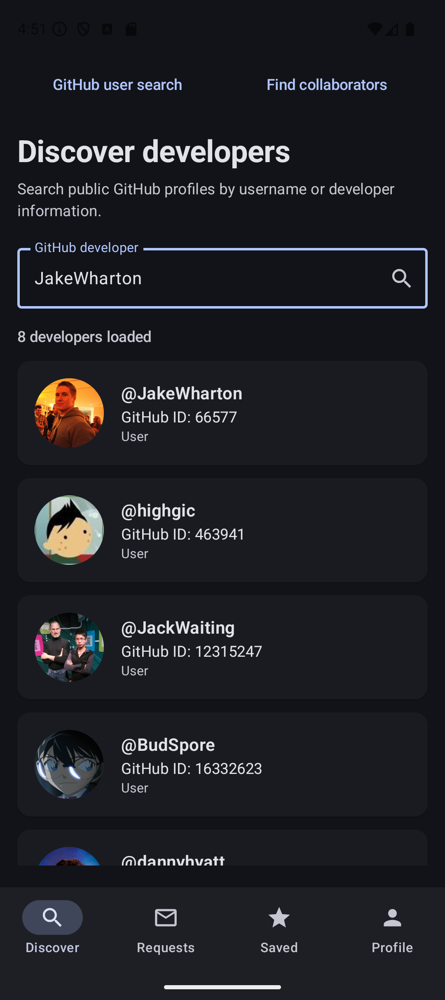
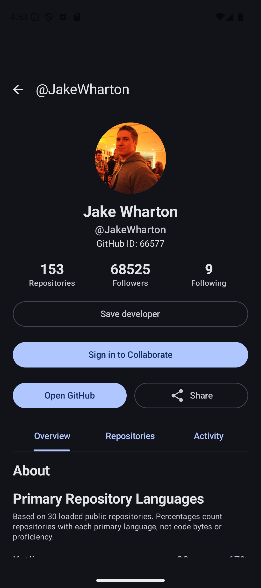
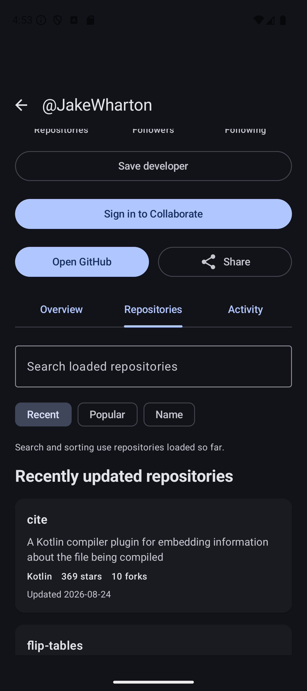
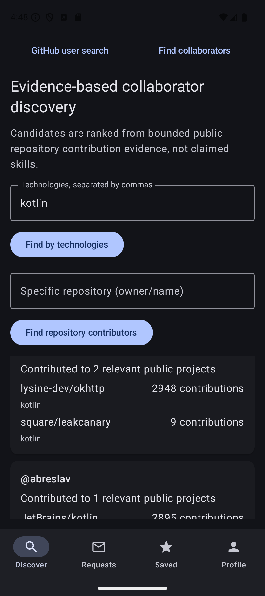
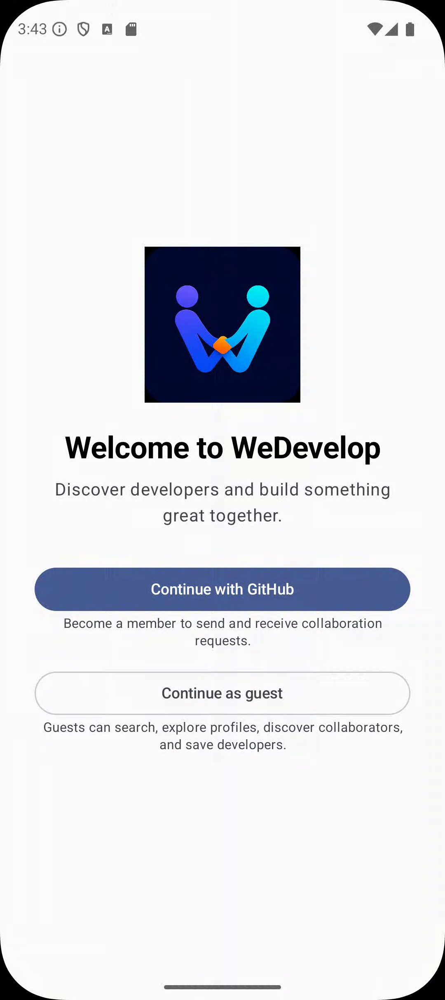
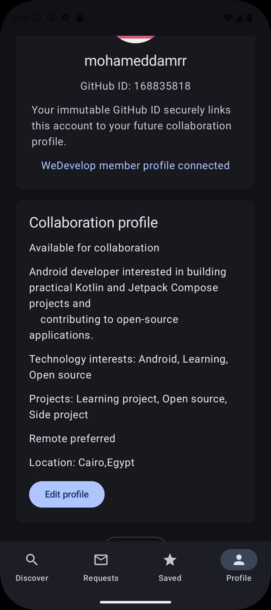
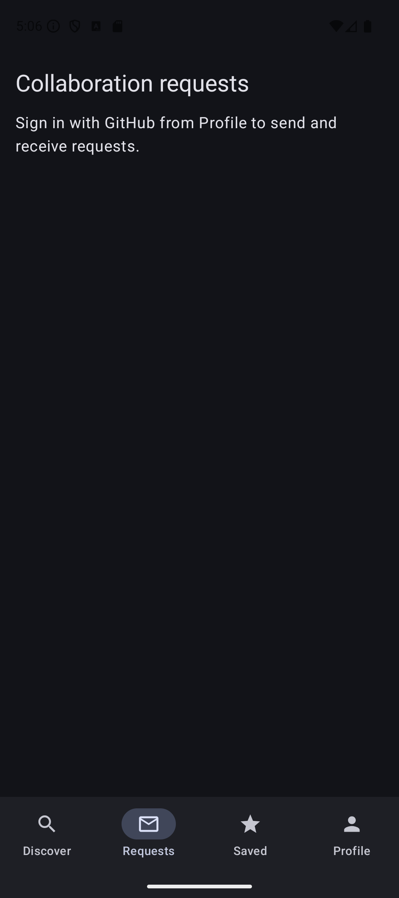

# DevCollab

DevCollab is a Kotlin and Jetpack Compose Android app for discovering potential developer collaborators. It began as the VOIS GitHub-user-search assignment and preserves that complete baseline while adding rich GitHub profiles, evidence-based discovery, GitHub OAuth, collaboration profiles and requests, and locally saved developers.

Public GitHub work is treated as **evidence**, not proof of expertise. The app reports relevant public projects and contributions; it does not invent skills or opaque “AI match” percentages.

## Features

### Complete VOIS baseline

- GitHub search through `GET /search/users`, with debouncing and Paging 3
- Result avatar, login, immutable GitHub ID, and account type
- Details navigation through `GET /users/{username}`
- Initial/append loading, empty, error, retry, and completion states
- Room-backed last-query/result persistence and offline restoration
- Meaningful ViewModel, repository, networking, Paging, Room, and UI tests

### Expanded product

- Overview, Repositories, and Activity profile tabs
- Repository search/sorting, language evidence, recent activity, and external links
- Firebase Authentication using GitHub OAuth
- App-member profiles with availability and self-declared collaboration preferences
- Technology- and repository-based discovery
- Bounded contributor aggregation, deduplication, deterministic ranking, and visible “Why this developer?” evidence
- Contextual requests with Pending, Accepted, Declined, and Cancelled states
- Locally persisted saved developers
- Native GitHub opening and Android share-sheet actions

## Architecture

DevCollab uses MVVM, repository boundaries, unidirectional data flow, immutable UI state, coroutines, and `StateFlow`.

```text
Compose UI --events--> ViewModel --operations--> Repository / domain logic
     ^                    |                         /       |       \
     |                    | StateFlow              v        v        v
     +--------------------+                    GitHub   Firestore   Room
```

- Compose renders state and emits events; it does not call HTTP, SQL, or Firestore APIs.
- ViewModels coordinate work and expose immutable screen state.
- Repositories choose data sources and map transport/storage models.
- GitHub owns public data; Firestore owns member/request data; Room owns local data and caches.
- Pure domain code performs matching and request-state validation.

Read [Architecture](docs/ARCHITECTURE.md), the [Project plan](docs/PROJECT_PLAN.md), and the [Interview guide](docs/INTERVIEW_GUIDE.md).

## Technology stack

- Kotlin, Coroutines, Flow, and `StateFlow`
- Jetpack Compose, Material 3, Navigation Compose
- Retrofit, OkHttp, and kotlinx.serialization
- Paging 3, Room, KSP, and Coil
- Firebase Authentication, GitHub OAuth, and Cloud Firestore
- JUnit, kotlinx-coroutines-test, MockWebServer, Room tests, and Compose UI tests

Versions are centralized in `gradle/libs.versions.toml`.

## Data ownership

| Data | Authority | Local behavior |
|---|---|---|
| GitHub profiles, repositories, contributors, activity | GitHub REST API | Cached where implemented; stale state is labelled |
| Authentication session | Firebase Auth | Restored by Firebase SDK |
| Member profile and requests | Cloud Firestore | Firestore remains authoritative |
| Last search/results | GitHub online | Room restores the latest successful snapshot |
| Saved developers | Room | Locally authoritative in V1 |

If GitHub fails, the repository checks Room. It displays labelled cached content when available; otherwise the UI shows an error and Retry.

## Setup

### Android

1. Clone the repository and open it in Android Studio.
2. Install the SDK declared in `app/build.gradle.kts` and let Gradle sync.
3. Run on an emulator/device meeting the configured `minSdk`.

### Firebase and GitHub OAuth

Secrets and `app/google-services.json` are intentionally excluded from Git.

1. Register package `com.mohamedamr.devcollab` in Firebase.
2. Put the downloaded configuration at `app/google-services.json`.
3. Add required debug/release SHA fingerprints in Firebase.
4. Create a GitHub OAuth App and use Firebase’s callback URL: `https://<project-id>.firebaseapp.com/__/auth/handler`.
5. Enable GitHub in Firebase Authentication and enter the client ID/secret in the Firebase console only.
6. Create Firestore and publish the complete `firestore.rules` in **Firestore Database → Rules**.

Never put the GitHub client secret in Kotlin, committed Gradle properties, or `google-services.json`.

## Demonstration

1. Search and scroll to load another page.
2. Open a developer and show profile tabs, repository links, GitHub, and sharing.
3. Search successfully, close the app, disable networking, and reopen to show Room restoration.
4. Sign in with GitHub and complete the collaboration profile.
5. Discover by technologies or `owner/repository` and explain the evidence.
6. Save a developer and verify Saved persists.
7. With a second registered account, demonstrate sending and transitioning a request.

GitHub-only users cannot receive requests. Two registered Firebase/GitHub accounts are required to test both request participants.

## Tests

```powershell
.\gradlew.bat testDebugUnitTest
.\gradlew.bat connectedDebugAndroidTest
.\gradlew.bat assembleDebug lintDebug
```

Coverage includes ViewModel states, remote/cache behavior, Room ordering/restoration, paging, matching/deduplication, evidence, and request transitions. Test Firestore rules against the Firebase Emulator Suite before production deployment.

## Screenshots

<table>
  <tr>
    <td align="center"><strong>GitHub developer search</strong></td>
    <td align="center"><strong>Developer profile</strong></td>
  </tr>
  <tr>
    <td></td>
    <td></td>
  </tr>
  <tr>
    <td align="center"><strong>Repository exploration</strong></td>
    <td align="center"><strong>Evidence-based discovery</strong></td>
  </tr>
  <tr>
    <td></td>
    <td></td>
  </tr>
  <tr>
    <td align="center"><strong>GitHub sign-in</strong></td>
    <td align="center"><strong>Member profile</strong></td>
  </tr>
  <tr>
    <td></td>
    <td></td>
  </tr>
  <tr>
    <td colspan="2" align="center"><strong>Collaboration requests</strong></td>
  </tr>
  <tr>
    <td colspan="2" align="center"></td>
  </tr>
</table>

## Limitations

- Public repositories do not represent all experience; private work is unavailable.
- Languages, topics, and contributions are evidence, not guaranteed proficiency.
- Organization membership is not employment verification.
- GitHub-only users have not opted into DevCollab.
- Rate limits require bounded repository/contributor discovery.
- Recent events are not lifetime contribution history.
- Language percentages summarize loaded repositories, not byte-level usage or skills.
- Saved developers are device-local in V1.
- V1 has no chat and exposes only voluntarily supplied contact information.

## Original assignment status

- [x] Kotlin and Jetpack Compose
- [x] GitHub Search Users API and result list
- [x] ID, avatar, login, and useful fields
- [x] Details navigation and GitHub User Details API
- [x] Pagination
- [x] Last-search persistence and relaunch restoration
- [x] Meaningful tests
- [x] Incremental Git history

The protected assignment baseline was completed at Phase 7; later features preserve that independently demonstrable flow.
